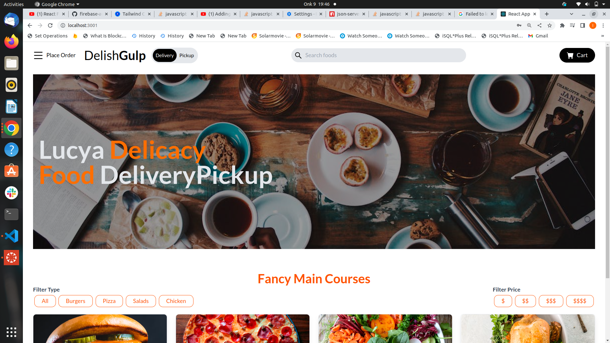

The FOOD_APP website is an interactive,easy to use client-side web interface.
The app main functionality is to enable users to navigate to the app with ease,login to their accounts before making an order and take you to the sign up page if you do not have an account where your user details will be stored in firebase Authentication for backend storage.
Here is a sample of the app.

